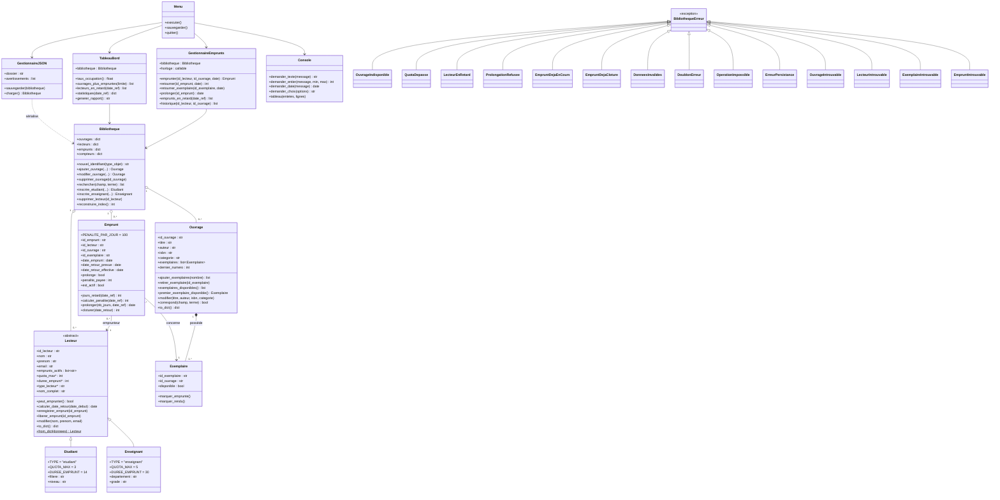

# Diagramme de classes UML

Rendu automatique par GitHub de [`diagramme_classes.mmd`](diagramme_classes.mmd).
Version image : [`diagramme_classes.png`](diagramme_classes.png).

```mermaid
classDiagram
    direction TB

    class Lecteur {
        <<abstract>>
        +id_lecteur : str
        +nom : str
        +prenom : str
        +email : str
        +emprunts_actifs : list~str~
        +quota_max* : int
        +duree_emprunt* : int
        +type_lecteur* : str
        +nom_complet : str
        +peut_emprunter() bool
        +calculer_date_retour(date_debut) date
        +enregistrer_emprunt(id_emprunt)
        +liberer_emprunt(id_emprunt)
        +modifier(nom, prenom, email)
        +to_dict() dict
        +from_dict(donnees)$ Lecteur
    }
    class Etudiant {
        +TYPE = "etudiant"
        +QUOTA_MAX = 3
        +DUREE_EMPRUNT = 14
        +filiere : str
        +niveau : str
    }
    class Enseignant {
        +TYPE = "enseignant"
        +QUOTA_MAX = 5
        +DUREE_EMPRUNT = 30
        +departement : str
        +grade : str
    }
    Lecteur <|-- Etudiant
    Lecteur <|-- Enseignant

    class Ouvrage {
        +id_ouvrage : str
        +titre : str
        +auteur : str
        +isbn : str
        +categorie : str
        +exemplaires : list~Exemplaire~
        +dernier_numero : int
        +ajouter_exemplaires(nombre) list
        +retirer_exemplaire(id_exemplaire)
        +exemplaires_disponibles() list
        +premier_exemplaire_disponible() Exemplaire
        +modifier(titre, auteur, isbn, categorie)
        +correspond(champ, terme) bool
        +to_dict() dict
    }
    class Exemplaire {
        +id_exemplaire : str
        +id_ouvrage : str
        +disponible : bool
        +marquer_emprunte()
        +marquer_rendu()
    }
    class Emprunt {
        +PENALITE_PAR_JOUR = 100
        +id_emprunt : str
        +id_lecteur : str
        +id_ouvrage : str
        +id_exemplaire : str
        +date_emprunt : date
        +date_retour_prevue : date
        +date_retour_effective : date
        +prolonge : bool
        +penalite_payee : int
        +est_actif : bool
        +jours_retard(date_ref) int
        +calculer_penalite(date_ref) int
        +prolonger(nb_jours, date_ref) date
        +cloturer(date_retour) int
    }
    Ouvrage "1" *-- "1..*" Exemplaire : possède
    Emprunt "0..*" --> "1" Exemplaire : concerne
    Emprunt "0..*" --> "1" Lecteur : emprunteur

    class Bibliotheque {
        +ouvrages : dict
        +lecteurs : dict
        +emprunts : dict
        +compteurs : dict
        +nouvel_identifiant(type_objet) str
        +ajouter_ouvrage(...) Ouvrage
        +modifier_ouvrage(...) Ouvrage
        +supprimer_ouvrage(id_ouvrage)
        +rechercher(champ, terme) list
        +inscrire_etudiant(...) Etudiant
        +inscrire_enseignant(...) Enseignant
        +supprimer_lecteur(id_lecteur)
        +reconstruire_index() int
    }
    class GestionnaireEmprunts {
        +bibliotheque : Bibliotheque
        +horloge : callable
        +emprunter(id_lecteur, id_ouvrage, date) Emprunt
        +retourner(id_emprunt, date) int
        +retourner_exemplaire(id_exemplaire, date)
        +prolonger(id_emprunt) date
        +emprunts_en_retard(date_ref) list
        +historique(id_lecteur, id_ouvrage) list
    }
    class TableauBord {
        +bibliotheque : Bibliotheque
        +taux_occupation() float
        +ouvrages_plus_empruntes(limite) list
        +lecteurs_en_retard(date_ref) list
        +statistiques(date_ref) dict
        +generer_rapport() str
    }
    class GestionnaireJSON {
        +dossier : str
        +avertissements : list
        +sauvegarder(bibliotheque)
        +charger() Bibliotheque
    }
    class Menu {
        +executer()
        +sauvegarder()
        +quitter()
    }
    class Console {
        +demander_texte(message) str
        +demander_entier(message, min, max) int
        +demander_date(message) date
        +demander_choix(options) str
        +tableau(entetes, lignes)
    }
    Bibliotheque "1" o-- "0..*" Ouvrage
    Bibliotheque "1" o-- "0..*" Lecteur
    Bibliotheque "1" o-- "0..*" Emprunt
    GestionnaireEmprunts --> Bibliotheque
    TableauBord --> Bibliotheque
    GestionnaireJSON ..> Bibliotheque : sérialise
    Menu --> GestionnaireEmprunts
    Menu --> TableauBord
    Menu --> GestionnaireJSON
    Menu --> Console

    class BibliothequeErreur {
        <<exception>>
    }
    BibliothequeErreur <|-- OuvrageIndisponible
    BibliothequeErreur <|-- QuotaDepasse
    BibliothequeErreur <|-- LecteurEnRetard
    BibliothequeErreur <|-- ProlongationRefusee
    BibliothequeErreur <|-- EmpruntDejaEnCours
    BibliothequeErreur <|-- EmpruntDejaCloture
    BibliothequeErreur <|-- DonneesInvalides
    BibliothequeErreur <|-- DoublonErreur
    BibliothequeErreur <|-- OperationImpossible
    BibliothequeErreur <|-- ErreurPersistance
    BibliothequeErreur <|-- OuvrageIntrouvable
    BibliothequeErreur <|-- LecteurIntrouvable
    BibliothequeErreur <|-- ExemplaireIntrouvable
    BibliothequeErreur <|-- EmpruntIntrouvable
```
